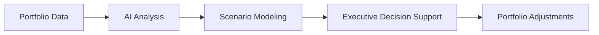

# AI-Assisted Product Operations


---

## Overview

This repository explores how artificial intelligence can augment product portfolio governance and product operations.

AI systems can assist leadership by improving scenario analysis, delivery risk prediction, and decision preparation.

The goal is to enhance the decision capabilities of product and technology leadership teams.

---

## AI Decision Architecture



---

## AI Use Cases in Product Operations

AI can assist leadership in several areas.

### Portfolio Scenario Modeling

Evaluate potential investment allocation scenarios.

### Delivery Risk Analysis

Identify initiatives at risk of delay or delivery failure.

### Decision Artifact Preparation

Assist in drafting investment memos and executive decision briefs.

### Roadmap Analysis

Evaluate product roadmaps for strategic alignment.

---

## Governance Considerations

AI systems should support, not replace, leadership governance.

Key principles:

- human decision authority  
- transparent analytical inputs  
- traceable decision artifacts  

---

## Relationship to Portfolio Governance

AI capabilities enhance the portfolio governance system defined in:

```
enterprise-product-operating-model
```

by improving analytical depth and decision preparation.

---

## Versioning

**v1.0 — AI-Assisted Product Operations**

---

## License

MIT License
