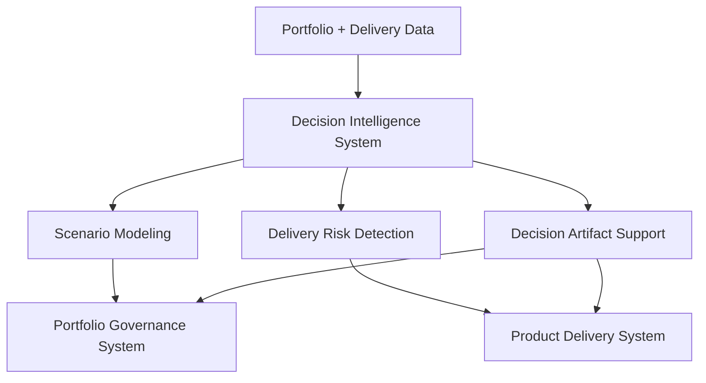

# AI-Assisted Product Operations


---

## Overview

This repository explores how artificial intelligence can augment product portfolio governance and product operations.

AI systems can assist leadership by improving scenario analysis, delivery risk prediction, and decision preparation.

The goal is to enhance the decision capabilities of product and technology leadership teams.

# Decision Intelligence System

AI-assisted analytical operating system supporting portfolio governance and product delivery through scenario modeling, delivery risk detection, and executive decision preparation.

The Decision Intelligence System augments leadership decision-making by synthesizing signals from across the product organization and translating them into actionable insights for portfolio and delivery governance.

---

## Role in the Product Leadership Systems Architecture



The Decision Intelligence System supports leadership by analyzing signals from portfolio governance and product delivery systems to provide forward-looking insights that improve decision quality and execution predictability.

---

## Operating Model

The Decision Intelligence System operates as an analytical support layer across the product organization.

Its responsibilities include:

- synthesizing portfolio and delivery signals into executive-relevant insights  
- identifying delivery risk earlier through dependency and schedule signals  
- enabling portfolio scenario modeling for investment decisions  
- assisting in the preparation of executive decision artifacts  

Rather than replacing leadership decision-making, the system enhances it by providing structured analytical inputs to governance processes.

---

## Core Components

The Decision Intelligence System typically includes the following analytical capabilities:

- Portfolio scenario modeling frameworks  
- Delivery risk signal detection (schedule risk, dependency risk, execution volatility)  
- Executive decision brief generation and artifact preparation  
- Data synthesis and portfolio analytics  
- Governance support tools for portfolio and delivery leadership

These components enable leadership teams to evaluate tradeoffs, anticipate delivery risks, and prepare informed decisions.

---

## Governance Model

Decision Intelligence outputs are integrated into existing governance processes rather than operating independently.

Typical governance touchpoints include:

Monthly Portfolio Reviews  
Analytical insights support prioritization, sequencing decisions, and risk evaluation.

Delivery Risk Reviews  
Execution risk signals are surfaced to product and engineering leadership to support mitigation actions.

Quarterly Strategic Reviews  
Scenario modeling helps leadership evaluate strategic investment tradeoffs and potential portfolio rebalancing.

Human-in-the-loop review ensures that AI-assisted analysis informs leadership decisions while maintaining executive accountability.

---

## Repository Structure

```
decision-intelligence-system
│
├── architecture
├── frameworks
├── templates
├── governance
├── artifacts
└── visualizations
```

Each directory represents a component of the decision intelligence operating system:

• **architecture** — analytical system architecture and supporting diagrams  
• **frameworks** — scenario modeling and analytical frameworks  
• **templates** — executive decision briefs and analytical report templates  
• **governance** — governance integration and analytical review cadence  
• **artifacts** — example analytical outputs generated by the system  
• **visualizations** — portfolio analytics dashboards and scenario models

---

## Related Systems

The Decision Intelligence System operates as part of the broader **Product Leadership Systems Architecture**.

| System | Purpose | Repository |
|------|------|------|
| Strategy Execution System | Translates enterprise strategy into initiatives and portfolio-ready investments | https://github.com/ChuckFerrando/strategy-execution-system |
| Portfolio Governance System (Flagship) | Governs prioritization, capital allocation, delivery risk evaluation, and portfolio visibility | https://github.com/ChuckFerrando/portfolio-governance-system |
| Product Delivery System | Operating model for executing funded initiatives with predictable delivery outcomes | https://github.com/ChuckFerrando/product-delivery-system |
| Architecture Portal | Documentation index for the Product Leadership Systems Architecture | https://github.com/ChuckFerrando/product-leadership-systems |

---

## License

MIT License

Copyright (c) 2026 Chuck Ferrando

Permission is hereby granted, free of charge, to any person obtaining a copy
of this documentation and associated files to use, copy, modify, merge,
publish, distribute, sublicense, and/or sell copies, subject to the
following conditions:

The above copyright notice and this permission notice shall be included
in all copies or substantial portions of the documentation.

THE DOCUMENTATION IS PROVIDED "AS IS", WITHOUT WARRANTY OF ANY KIND.
